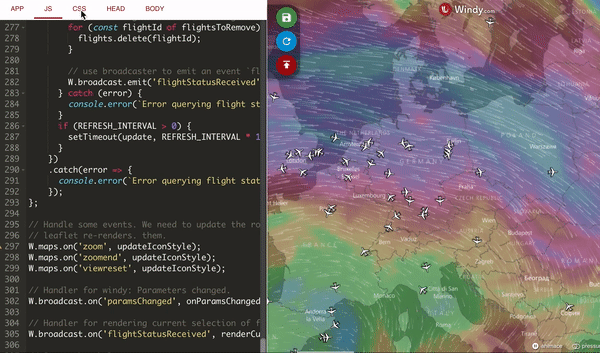

# Windy API



# Getting started
Windy API enables you to created your own Windy Apps with minimum effort. You do not need any server, and you can have your Windy App up and running in less than 5 minutes. 

Once you are logged in API console at [https://api.windy.com](https://api.windy.com), you can create one or more Windy Apps by adding JS, CSS or HTML code to client codes of Windy. 

Your published Windy App will be accessible on `https://mywindy.com/your-username/name-of-your-app`, or if you prefer private app, the URL will be somewhat mangled like `https://mywindy.com/your-username/507f191e810c19729de860ea`

If you want to run your Windy App on your own domain, set up your own server somewhere, and embed your App inside `iframe`

Windy API console let you edit **Javascript, CSS, Head** and **HTML** of Windy. While HTML is inserted just below `body` tag, head is inserted in `head` of a page (thus enabling to load any libraries). Your Javascript code will be launched when all the Windy code is loaded and running.

Windy API is free for time being, but Windy logo must remain visible and clickable in your App. Using Windy API inside native iOS or Android apps is prohibited and requires our permission.

# How to use Leaflet, jQuery or other libraries
Inside you Javascript code you can use already loaded Leaflet library, that occupies global object `L`. We use version 0.77 and we do not plan to upgrade right now. Leaflet documentation [is described here](http://leafletjs.com/)

Windy codes use global object `W`. 

Your Javascript code, that you will start writing inside API console, will be launched when document is loaded, Leaflet map is initialized, and all is up and running. Instance of Leaflet map is then available as `W.maps`

If you want use external library (for instance `jQuery`) or some Leaflet plugin just include few lines into **head** section of your Windy App, like this. This part of code will be added to `head` section of Windy App.

```html
<script src="https://cdnjs.cloudflare.com/ajax/libs/jquery/3.2.1/jquery.slim.min.js"></script>
<script src="https://cdnjs.cloudflare.com/ajax/libs/lodash.js/4.17.4/lodash.min.js"></script>
```